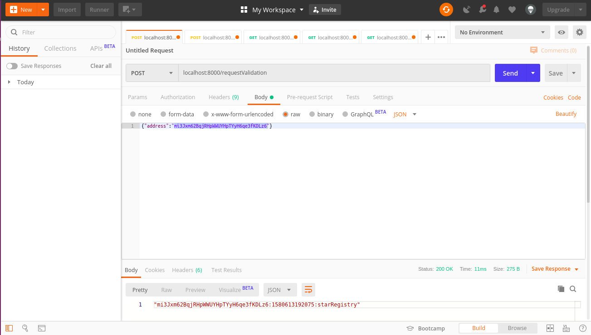

# Private Blockchain Application

## What problem will you solve implementing this private Blockchain application?

Your employer is trying to make a test of concept on how a Blockchain application can be implemented in his company.
He is an astronomy fans and he spend most of his free time on searching stars in the sky, that's why he would like
to create a test application that will allows him to register stars, and also some others of his friends can register stars
too but making sure the application know who owned each star.

## What tools or technologies you will use to create this application?

- This application will be created using Node.js and Javascript programming language. The architecture will use ES6 classes
because it will help us to organize the code and facilitate the maintnance of the code.
- The company suggest to use Visual Studio Code as an IDE to write your code because it will help you debug the code easily
but you can choose the code editor you feel confortable with.
- Some of the libraries or npm modules you will use are:
    - "bitcoinjs-lib": "^4.0.3",
    - "bitcoinjs-message": "^2.0.0",
    - "body-parser": "^1.18.3",
    - "crypto-js": "^3.1.9-1",
    - "express": "^4.16.4",
    - "hex2ascii": "0.0.3",
    - "morgan": "^1.9.1"

### Starting with the boilerplate code:

First thing first, we are going to download or clone our boilerplate code.

Then we need to install all the libraries and module dependencies, to do that: open a terminal and run the command `npm install`

At this point we are ready to run our project for first time, use the command: `npm start`

You can check in your terminal the the Express application is listening in the PORT 8000

## How to test your application functionalities?

To test your application I recommend you to use POSTMAN.

1. Run your application using the command `npm start`
You should see in your terminal a message indicating that the server is listening in port 8000:
> Server Listening for port: 8000

2. To make sure your application is working fine and it creates the Genesis Block you can use POSTMAN to request the Genesis block:
    
3. Make your first request of ownership sending your wallet address:
    
4. Sign the message with your Wallet:
    
5. Submit your Star
     
6. Retrieve Stars owned by me
    
7. validate blockchain function before mutation which gives an empty errorLog Array
    
8. mutate the blockchain: adds 2 blocks and then mutate the data to test the vlidateChain function  
    
9. validate blockchain function after mutation which gives an array of all the errors
    